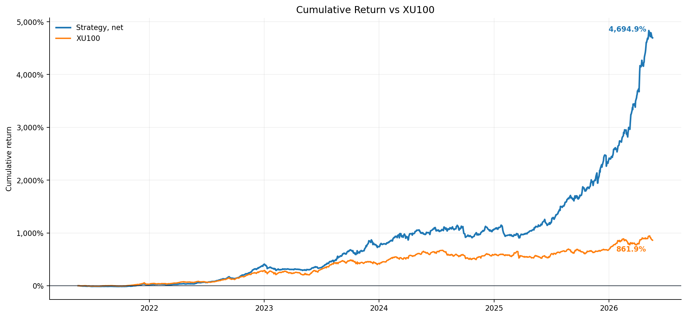
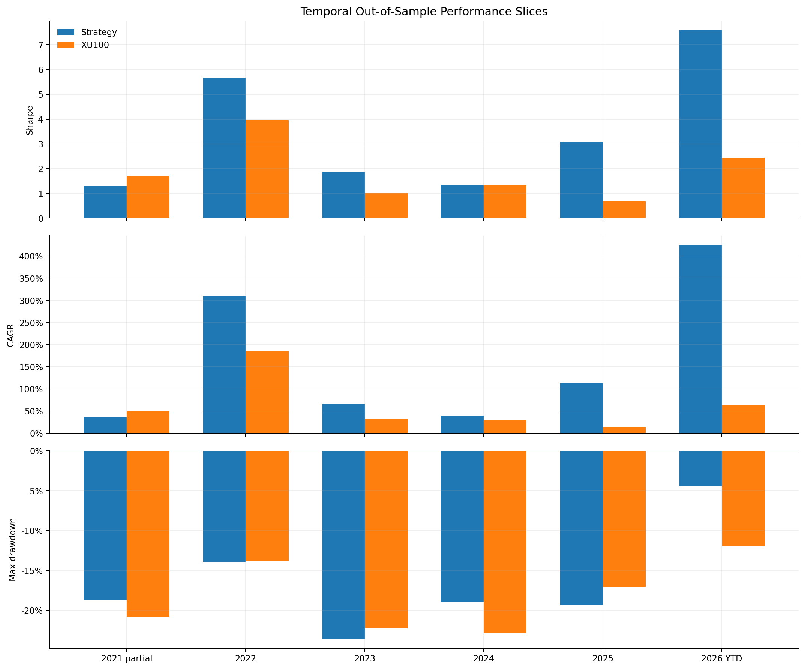
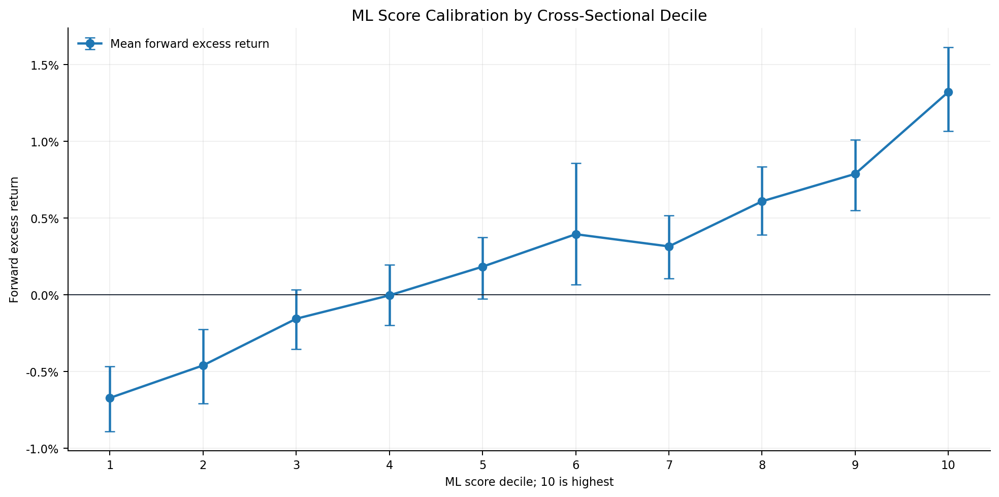
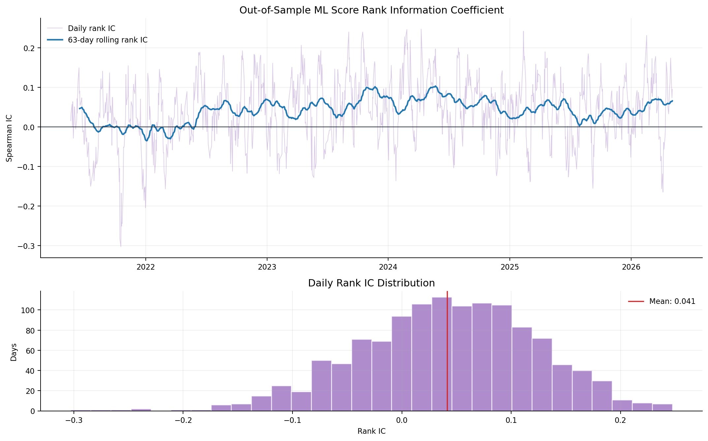
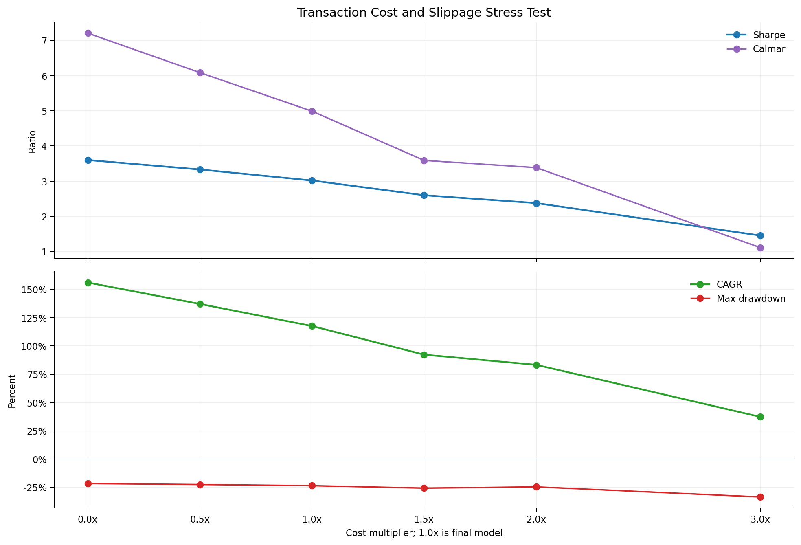
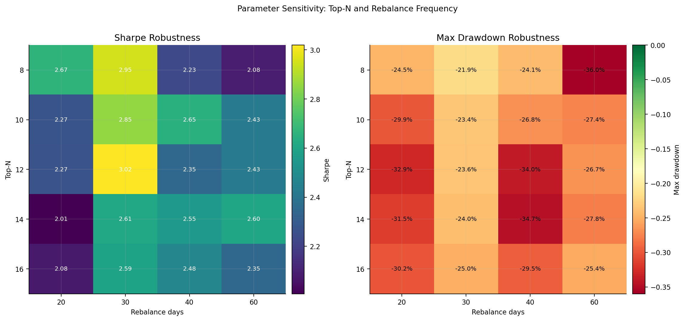

# VWAP & VP Based Algorithm

Research implementation of a long-only Borsa Istanbul momentum strategy using daily VWAP and Volume Profile proxies, walk-forward machine learning, liquidity-aware portfolio construction, dynamic execution costs, volatility targeting and momentum-decay exits.

> This is a quantitative research prototype, not investment advice or a live-performance claim.

## Reference Backtest

Period: `2021-05-20` to `2026-05-21`, with `1,255` trading days.

| Metric | Strategy | XU100 |
|---|---:|---:|
| Sharpe, zero risk-free rate | `3.019` | `1.754` |
| CAGR | `117.52%` | `57.55%` |
| Annualized volatility | `26.98%` | `28.21%` |
| Maximum drawdown | `-23.55%` | `-22.86%` |
| Calmar | `4.990` | `2.517` |
| Total return | `+4,694.89%` | `+861.93%` |

These results use a current all-BIST universe snapshot applied backward and therefore are not a survivorship-bias-free institutional performance claim.

## Financial and Mathematical Evidence

No single chart proves a persistent trading edge. The six figures below examine different requirements: economic performance, temporal consistency, cross-sectional predictability, execution-cost survival and parameter robustness.

### 1. Cumulative Return vs XU100

The cumulative-return curve compares the net strategy with XU100 after the configured turnover cost and dynamic slippage. The strategy reaches approximately `+4,694.89%`, versus `+861.93%` for XU100. This is the clearest economic summary, but cumulative return alone cannot distinguish genuine alpha from model-selection or universe bias.



### 2. Temporal Out-of-Sample Performance

All six chronological slices have positive strategy Sharpe ratios, and the strategy exceeds the XU100 Sharpe in five of six slices. The partial 2021 slice is the exception. This supports temporal persistence, although the slices belong to the same historical test interval and are not an untouched final holdout.



### 3. ML Score Calibration

The lowest score decile has approximately `-0.67%` mean forward excess return, while the highest decile has approximately `+1.32%`, producing a top-minus-bottom spread near `1.99` percentage points. The broadly monotonic relationship and date-level bootstrap intervals indicate that the ML score contains economically meaningful ranking information.



### 4. Rolling Rank Information Coefficient

The mean daily cross-sectional Spearman rank IC is `0.0414`; approximately `70.7%` of daily IC observations are positive. The 63-day rolling IC is positive for approximately `88.4%` of its available history and ends near `0.0657`. This measures stock-ranking power independently of the final portfolio weighting rules.



### 5. Transaction-Cost Stress Test

At the base cost setting, Sharpe is `3.019`. Under a `3x` cost and slippage stress, Sharpe remains `1.455`, CAGR remains approximately `37.25%`, and maximum drawdown reaches approximately `-33.53%`. The edge therefore survives materially harsher execution assumptions, though the cost model still requires live calibration.



### 6. Parameter Robustness

Across 20 combinations of `top_n` and rebalance frequency, every tested Sharpe ratio remains above `2.00`; the median is approximately `2.45` and the maximum is `3.019`. This reduces dependence on one exact parameter choice. Because the documented `12/30` setting is also the best tested cell, model-selection risk must still be acknowledged.



## Algorithm

1. Discover the Borsa Istanbul universe and exclude warrants, certificates, ETFs, funds, rights and other non-normal instruments.
2. Load daily adjusted OHLCV data from Yahoo Finance or supplied TradingView exports.
3. Build point-in-time VWAP20, VWAP63, POC, VAH, VAL, momentum, trend, volume, liquidity and relative-alpha features.
4. Convert continuous features into date-level cross-sectional ranks.
5. Train monthly walk-forward Ridge models using only observations whose forward labels are fully known before the training cutoff.
6. Rank positive-score stocks and apply sell-rank hysteresis plus a correlation filter.
7. Construct ML-dynamic weights subject to position and ADV participation caps.
8. Fill eligible residual cash through a liquid completion sleeve.
9. Apply volatility targeting, exposure limits, a drawdown governor and conservative momentum-decay exits.
10. Form signals after the close and execute orders at the next available open with turnover cost and dynamic slippage.

No minimum-volume filter is applied. Liquidity is handled through continuous features, hard position-capacity constraints and execution-cost estimates.

## Mathematical Definitions

The daily VWAP proxy over window `W` is:

```text
VWAP_W(t) = sum(HLC3_i * Volume_i) / sum(Volume_i)
```

Volume Profile assigns each prior-window day's volume to an HLC3 price bin. POC is the highest-volume bin; VAH and VAL bound the approximately `70%` value area. The current day is excluded from the profile used for that day's signal.

The primary ML target is forward benchmark-relative return scaled by forward realized volatility:

```text
y_i,t = (R_i,t->t+h - R_benchmark,t->t+h) / sigma_i,t->t+h
```

Feature coefficients are estimated by Ridge regression:

```text
beta = argmin ||y - X beta||^2 + lambda ||beta||^2
```

Portfolio returns separate overnight return, post-trade intraday return, turnover and transaction costs. Target weights formed at close `t` become executable at open `t+1`.

## Source Layout

| Path | Responsibility |
|---|---|
| `vwap_volume_profile/config.py` | Configuration and feature definitions. |
| `vwap_volume_profile/universe.py` | Universe discovery and instrument filtering. |
| `vwap_volume_profile/data.py` | OHLCV ingestion, cache handling and adjustment. |
| `vwap_volume_profile/indicators.py` | VWAP, Volume Profile and technical indicators. |
| `vwap_volume_profile/features.py` | Point-in-time feature engineering. |
| `vwap_volume_profile/model.py` | Walk-forward Ridge scoring. |
| `vwap_volume_profile/portfolio.py` | Selection, weighting, liquidity and execution costs. |
| `vwap_volume_profile/engine.py` | Next-open portfolio simulation and accounting. |
| `vwap_volume_profile/metrics.py` | Performance and overfitting diagnostics. |
| `vwap_volume_profile/reporting.py` | Generated backtest summary. |
| `vwap_volume_profile/cli.py` | End-to-end orchestration. |
| `tests/test_backtest_sanity.py` | Accounting and look-ahead sanity tests. |

`vwap_profile_ml_backtest.py` is the backward-compatible command-line entry point.

## Installation

```bash
python3 -m pip install -r requirements.txt
```

## Run

The default CLI configuration runs the current all-BIST institutional specification:

```bash
python3 vwap_profile_ml_backtest.py
```

To use local TradingView OHLCV exports:

```bash
python3 vwap_profile_ml_backtest.py \
  --data-source tradingview \
  --tradingview-data-dir /path/to/tradingview/csv
```

Generated market data, feature panels and backtest outputs are written under `outputs/` and excluded from version control.

## Tests

```bash
python3 -m py_compile vwap_profile_ml_backtest.py vwap_volume_profile/*.py tests/test_backtest_sanity.py
python3 tests/test_backtest_sanity.py
```

## Limitations

- The current universe snapshot is not a point-in-time membership database.
- Daily VWAP and Volume Profile values are proxies; true session measures require intraday trades or bars.
- The execution model requires calibration to actual commissions, spreads, auctions, price limits, suspensions and market impact.
- Multiple configurations were evaluated on the same historical interval.
- An untouched holdout, point-in-time universe and independent live paper-trading period are required before deployment.
